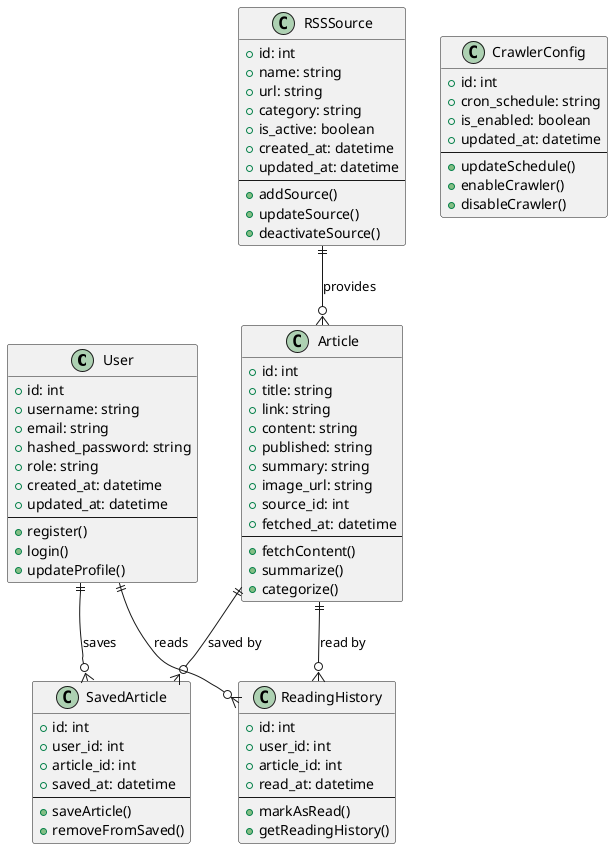
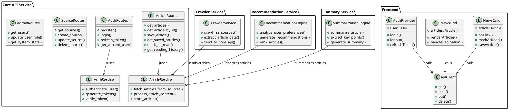

# Class Diagrams

This document contains the analysis class diagram and general class diagram for the news aggregation system.

## Analysis Class Diagram

The analysis class diagram shows the main domain concepts and their relationships identified during the analysis phase.

## General Class Diagram

The general class diagram shows the main implementation classes and their relationships in the system architecture.

## Diagram Explanations

### Analysis Class Diagram
- **User**: Represents system users with authentication and profile management capabilities
- **RSSSource**: Represents RSS feed sources that provide articles
- **Article**: Core entity representing news articles with content and metadata
- **SavedArticle**: Junction entity for user's saved articles
- **ReadingHistory**: Tracks user's reading activity
- **CrawlerConfig**: Configuration for the crawling system

### General Class Diagram
- **Core API Service**: Main backend service with route handlers and business logic
- **Crawler Service**: Handles RSS feed crawling and article extraction
- **Recommendation Service**: Provides personalized article recommendations
- **Summary Service**: Generates article summaries
- **Frontend**: React components and utilities for user interface

The relationships show the dependencies and data flow between different components of the system.